# Sơ Đồ Kiến Trúc Dự Án Tabo ERP Web

Tài liệu này là bản đồ tra cứu nhanh cho agent và dev khi làm việc trên codebase Tabo ERP Web.
Mục tiêu không chỉ là vẽ component tree, mà còn giảm số lần phải mở source để tìm:
- Route nào render page nào.
- Page nào dùng section/component nào.
- Component nào đang kéo dữ liệu từ `constants/`, `types/`, `lib/`, hoặc `assets/`.
- Route metadata, prefetch, và SEO cơ bản đang nằm ở đâu.
- File nào nên đọc trước tùy theo loại task.

## 1. Sơ Đồ Kiến Trúc Tổng Thể
*Luồng runtime từ entry point đến route, page, section, và các lớp dữ liệu dùng chung.*

```mermaid
graph TD
    %% Runtime entry
    Main[src/main.tsx] --> ThemeProvider[context/ThemeContext.tsx]
    ThemeProvider --> App[src/App.tsx]
    App --> SiteConfig[src/config/site.ts]
    App --> RoutesDef[src/config/routes.ts]

    %% App shell — App.tsx delegates to AppFrame
    App --> MetadataProvider[components/seo/MetadataProvider.tsx]
    App --> AppFrame[src/app/AppFrame.tsx]

    AppFrame --> Router[BrowserRouter / Routes]
    AppFrame --> ScrollToTop[components/layout/ScrollToTop.tsx]
    AppFrame --> Layout[[components/layout/Layout.tsx]]
    AppFrame --> RouteMeta[components/seo/RouteDocumentMeta.tsx]
    AppFrame --> SkeletonLayouts[components/common/SkeletonLayouts.tsx]

    Layout --> Navbar[components/layout/Navbar.tsx]
    Layout --> CTA[components/home/CTASection.tsx]
    Layout --> Footer[components/layout/Footer.tsx]

    Navbar --> ThemeToggle[components/ui/ThemeToggle.tsx]
    Navbar --> UiIndex[components/ui/index.ts]
    Navbar --> Prefetch[components/ui/PrefetchLink.tsx]
    Footer --> LogoWhite[src/assets/Logo-white.png]
    Navbar --> LogoBlack[src/assets/logo-black.png]
    Navbar --> LogoWhite

    %% Routes (defined in routes.ts, rendered by AppFrame)
    Router --> RouteHome[Route: /]
    Router --> RoutePricing[Route: /pricing]
    Router --> RouteAbout[Route: /about]
    Router --> RouteContact[Route: /contact]
    Router --> RouteBlog[Route: /blog]
    Router --> RouteBlogCategory[Route: /blog/category/:categorySlug]
    Router --> RouteBlogPost[Route: /blog/:slug]
    Router --> RouteNotFound[Route: *]

    RouteHome --> HomePage[src/pages/Home.tsx]
    RoutePricing --> PricingPage[src/pages/Pricing.tsx]
    RouteAbout --> AboutPage[src/pages/About.tsx]
    RouteContact --> ContactPage[src/pages/Contact.tsx]
    RouteBlog --> BlogIndex[src/pages/BlogIndex.tsx]
    RouteBlogCategory --> BlogCategory[src/pages/BlogCategory.tsx]
    RouteBlogPost --> BlogPost[src/pages/BlogPost.tsx]
    RouteNotFound --> NotFound[src/pages/NotFound.tsx]

    %% Home page
    HomePage --> HomeHero[components/home/HeroSection.tsx]
    HomePage --> HomeFeatures[components/home/FeaturesSection.tsx]
    HomePage --> HomeStrip[components/home/StripBanner.tsx]
    HomePage --> DeferredSection[components/common/DeferredSection.tsx]
    HomePage --> ErrorBoundary[components/common/ErrorBoundary.tsx]
    HomePage --> HomeLazy[React.lazy sections]

    HomeLazy --> SolutionsSection[components/home/SolutionsSection.tsx]
    HomeLazy --> VisionSection[components/home/VisionSection.tsx]
    HomeLazy --> StrategySection[components/home/StrategySection.tsx]
    HomeLazy --> PricingSection[components/pricing/PricingSection.tsx]
    HomeLazy --> TestimonialsSection[components/home/TestimonialsSection.tsx]

    HomeHero --> HomeContent[src/content/home.ts]
    HomeHero --> ViewportHook[src/hooks/useViewportActivity.ts]

    SolutionsSection --> LandingConstants[src/constants/landing/index.ts]
    SolutionsSection --> LandingTypes[src/types/landing.ts]
    HomeFeatures --> LandingConstants
    HomeFeatures --> LandingTypes
    HomeFeatures --> ViewportHook
    PricingSection --> LandingConstants
    PricingSection --> LandingTypes

    %% Pricing page
    PricingPage --> PricingHero[components/pricing/PricingHero.tsx]
    PricingPage --> DeferredSection
    PricingPage --> PricingLazy[React.lazy PricingSection + Features + FAQ]
    PricingPage --> SkeletonLayouts
    PricingLazy --> PricingSection
    PricingLazy --> PricingFeatures[components/pricing/PricingFeatures.tsx]
    PricingLazy --> PricingFAQ[components/pricing/PricingFAQ.tsx]
    PricingHero --> UiIndex
    PricingHero --> ViewportHook
    PricingFeatures --> UiIndex
    PricingFAQ --> UiIndex

    %% About page
    AboutPage --> AboutHero[components/about/AboutHero.tsx]
    AboutPage --> AboutMission[components/about/AboutMission.tsx]
    AboutPage --> DeferredSection
    AboutPage --> SkeletonLayouts
    AboutPage --> AboutLazy[React.lazy About sections]
    AboutLazy --> AboutGrid[components/about/AboutGrid.tsx]
    AboutLazy --> AboutBottomCTA[components/about/AboutBottomCTA.tsx]
    AboutLazy --> AboutFAQ[components/about/AboutFAQ.tsx]
    AboutGrid --> AboutContent[src/content/about.ts]
    AboutGrid --> AboutAsset[src/assets/about-team.svg]
    AboutHero --> ViewportHook
    AboutBottomCTA --> ViewportHook

    %% Contact page
    ContactPage --> ContactHero[components/contact/ContactHero.tsx]
    ContactPage --> ContactInfo[components/contact/ContactInfo.tsx]
    ContactPage --> DeferredSection
    ContactPage --> ContactFAQ[components/contact/ContactFAQ.tsx]
    ContactInfo --> LazyMap[components/contact/LazyMapEmbed.tsx]
    ContactInfo --> SiteConfig
    ContactHero --> ViewportHook

    %% Blog Index page
    BlogIndex --> BlogCard[components/blog/BlogCard.tsx]
    BlogIndex --> BlogRepo[lib/blog/repository.ts]
    BlogIndex --> BlogSeo[lib/blog/seo.ts]
    BlogIndex --> SeoHook[components/seo/usePageMetadata.ts]
    BlogIndex --> UiIndex

    %% Blog Category page
    BlogCategory --> BlogCard
    BlogCategory --> BlogRepo
    BlogCategory --> BlogSeo
    BlogCategory --> SeoHook
    BlogCategory --> UiIndex

    %% Blog Post page
    BlogPost --> BlogPostHeader[components/blog/BlogPostHeader.tsx]
    BlogPost --> BlogArticleBody[components/blog/BlogArticleBody.tsx]
    BlogPost --> BlogPostSidebar[components/blog/BlogPostSidebar.tsx]
    BlogPost --> RelatedPostsSection[components/blog/RelatedPostsSection.tsx]
    BlogPost --> BlogRepo
    BlogPost --> BlogSeo
    BlogPost --> SeoHook
    BlogPost --> UiIndex

    BlogPostHeader --> BlogTypes[lib/blog/types.ts]
    BlogPostHeader --> BlogRepo
    BlogPostHeader --> UiIndex
    BlogPostSidebar --> UiIndex
    RelatedPostsSection --> BlogCard
    RelatedPostsSection --> BlogTypes
    RelatedPostsSection --> UiIndex

    %% BlogSidebar (used internally by BlogIndex / Category)
    BlogIndex --> BlogSidebar[components/blog/BlogSidebar.tsx]
    BlogSidebar --> BlogTypes
    BlogSidebar --> UiIndex

    BlogRepo --> BlogTypes
    BlogRepo --> BlogCategoryMap[lib/blog/categories.ts]

    %% Shared UI primitives
    subgraph UI_Primitives[components/ui]
        Button[Button.tsx]
        Badge[Badge.tsx]
        Accordion[Accordion.tsx]
        Icon[Icon.tsx]
        ThemeToggle
        UiIndex
    end

    %% Shared data and contracts
    subgraph Shared_Data[Shared Data Layer]
        LandingConstants
        LandingTypes
        SiteConfig
        RoutesDef
        HomeContent
        AboutContent
        BlogTypes
    end

    %% Common utilities
    subgraph Common[Common / Infra]
        ErrorBoundary
        DeferredSection
        SkeletonLayouts
        Skeleton[components/common/Skeleton.tsx]
        ViewportHook
        Supabase[src/lib/supabase.ts]
        BlogRepo
        BlogCategoryMap
        BlogSeo
        MetadataProvider
        RoutePrefetch[src/lib/route-prefetch.ts]
    end

    %% Shared dependencies
    UiIndex --> Button
    UiIndex --> Badge
    UiIndex --> Accordion
    UiIndex --> Icon
    UiIndex --> Prefetch
    UiIndex --> ThemeToggle
    Prefetch --> RoutePrefetch
    SkeletonLayouts --> Skeleton

    HomeHero --> UiIndex
    HomeFeatures --> UiIndex
    HomeStrip --> UiIndex
    HomeStrip --> ViewportHook
    SolutionsSection --> UiIndex
    TestimonialsSection --> UiIndex
    VisionSection --> UiIndex
    StrategySection --> UiIndex

    AboutHero --> UiIndex
    AboutMission --> UiIndex
    AboutGrid --> UiIndex
    AboutBottomCTA --> UiIndex
    AboutFAQ --> UiIndex

    ContactHero --> UiIndex
    ContactInfo --> UiIndex
    ContactFAQ --> UiIndex
```

## 2. Bản Đồ Đọc Nhanh Cho Agent

Khi cần sửa một phần cụ thể, đọc theo thứ tự này để giảm research:

| Loại task | File nên mở trước | Lý do |
| --- | --- | --- |
| Đổi route / thêm page | `src/config/routes.ts`, `src/app/AppFrame.tsx`, `src/pages/<Page>.tsx` | Route được khai báo tập trung tại `routes.ts`, render bởi `AppFrame`. |
| Đổi SEO / title / meta route | `src/config/site.ts`, `src/components/seo/RouteDocumentMeta.tsx`, `src/components/seo/MetadataProvider.tsx` | Route metadata và document title/description đã được gom về đây. |
| Đổi layout chung | `src/components/layout/Layout.tsx`, `Navbar.tsx`, `Footer.tsx`, `ScrollToTop.tsx` | Layout bao toàn app, ảnh hưởng mọi trang. |
| Đổi UI primitive | `src/components/ui/index.ts` và các file trong `src/components/ui/` | Đây là public entry của Button, Badge, Icon, Accordion, ThemeToggle, PrefetchLink. |
| Đổi hiệu ứng scroll / viewport | `src/hooks/useViewportActivity.ts` | Hook dùng chung kích hoạt animation khi section vào viewport. |
| Đổi skeleton / loading state | `src/components/common/SkeletonLayouts.tsx`, `src/components/common/Skeleton.tsx` | Mọi fallback của Suspense và DeferredSection kéo skeleton từ đây. |
| Đổi lazy-load boundary | `src/components/common/DeferredSection.tsx` | Bọc IntersectionObserver quanh các lazy section để trì hoãn mount cho đến khi gần viewport. |
| Đổi nội dung landing page | `src/constants/landing/index.ts` | Copy và data của trang đang được tách riêng ở đây. |
| Đổi kiểu dữ liệu dùng chung | `src/types/landing.ts` | Nên cập nhật type trước khi sửa component dùng chung. |
| Đổi Home sections | `src/pages/Home.tsx` và `src/components/home/` | Home có phần tải lười và phụ thuộc data layer. |
| Đổi Pricing | `src/pages/Pricing.tsx` và `src/components/pricing/` | `PricingSection` được dùng lại ở Home và Pricing. |
| Đổi About | `src/pages/About.tsx` và `src/components/about/` | Page này là composition tuyến tính của các section; About sections lazy qua DeferredSection. |
| Đổi Contact | `src/pages/Contact.tsx` và `src/components/contact/` | Contact cũng là composition tuyến tính. |
| Đổi Blog Index / Category | `src/pages/BlogIndex.tsx`, `src/pages/BlogCategory.tsx`, `src/components/blog/BlogCard.tsx`, `src/components/blog/BlogSidebar.tsx` | BlogSidebar dùng tại BlogIndex để lọc category và hiển thị bài nổi bật. |
| Đổi Blog Post detail | `src/pages/BlogPost.tsx`, `BlogPostHeader`, `BlogArticleBody`, `BlogPostSidebar`, `RelatedPostsSection` | BlogPost ghép 4 sub-component; header, body, sidebar và phần gợi ý bài liên quan. |
| Đổi blog data layer | `src/lib/blog/repository.ts`, `src/lib/blog/types.ts`, `src/lib/blog/categories.ts` | Repository là adapter, types là hợp đồng, categories là mapping slug/label. |
| Đổi navigation / prefetch nội bộ | `src/config/site.ts`, `src/components/ui/PrefetchLink.tsx`, `src/lib/route-prefetch.ts` | Đây là lớp điều hướng dùng chung cho route lazy hiện tại. |
| Đổi auth / backend helper | `src/lib/supabase.ts` | Hiện tại chưa nằm trong runtime path chính. Nếu task không liên quan auth/backend, thường không cần mở file này. |
| Đổi branding asset | `src/assets/` | Logo được dùng ở Navbar và Footer. |

## 3. Cấu Trúc Thư Mục Và Vai Trò

| Đường dẫn / Thư mục | Trách nhiệm |
| --- | --- |
| `src/main.tsx` | Entry point, mount React root, bọc `ThemeProvider`, import global stylesheet. |
| `src/context/` | Quản lý theme state toàn cục. |
| `src/App.tsx` | Khởi tạo `BrowserRouter`, bọc `MetadataProvider` và render `AppFrame`. |
| `src/app/AppFrame.tsx` | Shell ứng dụng: gắn `Routes`, `Layout`, `ScrollToTop`, `RouteDocumentMeta`. Phân tách logic routing khỏi `App.tsx`. |
| `src/config/routes.ts` | Khai báo tập trung toàn bộ route definitions (`appRouteDefinitions`) dùng cho cả AppFrame và MetadataProvider. |
| `src/config/site.ts` | Nguồn sự thật cho site metadata, navigation labels, contact info và SEO cơ bản. |
| `src/pages/` | Mỗi file là một route-level page, chủ yếu chỉ lắp ráp các section. |
| `src/components/layout/` | Navbar, Footer, ScrollToTop, và shell bố cục chung. |
| `src/components/home/` | Các section của Home, trong đó một phần được lazy load qua `DeferredSection`. |
| `src/components/pricing/` | Các khối giao diện của trang Pricing; `PricingSection` được tái sử dụng ở Home. |
| `src/components/about/` | Các section của trang About; phần dưới lazy qua `DeferredSection`. |
| `src/components/contact/` | Các section của trang Contact; FAQ lazy qua `DeferredSection`. |
| `src/components/blog/` | Components Blog: `BlogCard` (card chung), `BlogSidebar` (lọc/bài nổi bật), `BlogPostHeader`, `BlogArticleBody`, `BlogPostSidebar`, `RelatedPostsSection`. |
| `src/components/ui/` | Primitive UI layer. File `index.ts` là entry public để import gọn. |
| `src/components/common/` | Cross-cutting concerns: `ErrorBoundary`, `DeferredSection` (IntersectionObserver lazy mount), `SkeletonLayouts` (fallback templates), `Skeleton` (atoms). |
| `src/components/seo/` | Đồng bộ document title/description theo route; `MetadataProvider` cung cấp context metadata toàn app. |
| `src/hooks/` | Custom hooks dùng chung: `useViewportActivity` kích hoạt data-motion-active khi section vào viewport. |
| `src/content/` | Nội dung typed cho các section marketing (home, about, faqs). |
| `src/constants/` | Dữ liệu, copy, và cấu hình tĩnh cho landing pages. |
| `src/types/` | TypeScript contracts dùng chung cho data layer và component props. |
| `src/lib/` | Helper hạ tầng và integration layer (blog repository, blog seo helpers, supabase, route-prefetch). |
| `src/lib/blog/` | Blog data layer: `repository.ts` (adapter/fetcher), `types.ts` (contracts), `categories.ts` (slug mapping), `seo.ts` (metadata builders), `mock.ts` (dev data). |
| `src/assets/` | Tài nguyên tĩnh như logo, ảnh thương hiệu. |

## 4. Các Điểm Quan Trọng Để Giảm Research

1. `App.tsx` không còn tự render Routes trực tiếp. Nó bọc `MetadataProvider` và delegate sang `AppFrame.tsx` — đây là shell thực sự xử lý routing.
2. `src/config/routes.ts` là nguồn sự thật duy nhất cho route definitions. Khi thêm route mới, đọc file này trước.
3. `Home.tsx` không render toàn bộ section cùng lúc. Phần nặng hơn được bọc trong `DeferredSection` + `React.lazy` + `Suspense` để trì hoãn mount cho đến khi gần viewport.
4. `PricingSection.tsx` là component dùng lại giữa Home và Pricing, nên sửa ở đây sẽ ảnh hưởng cả hai route.
5. `components/ui/index.ts` là lớp export công khai. Nếu agent cần UI primitive, nên đọc file này trước thay vì mò từng file một.
6. `src/constants/landing/index.ts` là nơi giữ nội dung chính của landing pages. Nhiều task chỉ cần sửa data ở đây, không cần đụng logic component.
7. `src/types/landing.ts` là hợp đồng dữ liệu. Nếu thay cấu trúc `constants/landing`, nên cập nhật type trước để tránh lan lỗi.
8. `src/config/site.ts` là nguồn sự thật cho route metadata, label navigation và SEO cơ bản. Nếu thêm route, sửa ở đây trước.
9. `src/hooks/useViewportActivity.ts` được dùng rộng rãi ở hầu hết các Hero section để kích hoạt animation CSS (`data-motion-active`). Nếu animation không chạy, đây là điểm kiểm tra đầu tiên.
10. `DeferredSection` dùng IntersectionObserver để trì hoãn mount React. Khác với `Suspense`, nó cũng bọc cả trigger mount, không chỉ fallback. About, Contact, Home, và Pricing đều dùng pattern này.
11. `SkeletonLayouts.tsx` export nhiều template skeleton chuyên biệt (`RouteSkeleton`, `PricingTableSkeleton`, `FAQSkeleton`, `ContentGridSkeleton`...). `RouteSkeleton` được dùng bởi AppFrame làm fallback default cho toàn bộ route.
12. Blog dùng adapter ở `src/lib/blog/repository.ts` và metadata động qua `components/seo/usePageMetadata.ts`; page/component không đọc mock data trực tiếp.
13. Build production hiện có thêm bước prerender blog routes qua `src/entry-server.tsx` và `scripts/prerender.mjs`.
14. Blog category detail route dùng path `/blog/category/:categorySlug`; mapping slug/category nằm ở `src/lib/blog/categories.ts`.
15. `src/lib/supabase.ts` hiện chưa nằm trong runtime path chính. Nếu task không liên quan auth/backend, thường không cần mở file này.

## 5. Quy Tắc Đồng Bộ Cho Agent

Khi thêm hoặc sửa kiến trúc, cập nhật `ARCHITECTURE.md` nếu có một trong các thay đổi sau:
- Thêm route mới hoặc page mới.
- Tách thêm section lớn ra component con.
- Thêm hoặc đổi metadata route, navigation, hoặc prefetch flow.
- Tạo thêm shared data mới trong `constants/`.
- Tạo thêm content module mới trong `content/`.
- Tạo thêm type dùng chung trong `types/`.
- Tạo thêm integration/helper ở `lib/`.
- Đổi hoặc thêm asset branding ở `assets/`.

Nếu chỉ sửa text nhỏ bên trong cùng một section, thường không cần mở rộng sơ đồ, nhưng vẫn nên giữ đúng mối quan hệ import hiện tại.
