# Sơ Đồ Kiến Trúc Dự Án Tabo ERP Web

Tài liệu này là bản đồ tra cứu nhanh cho agent và dev khi làm việc trên codebase Tabo ERP Web.
Mục tiêu không chỉ là vẽ component tree, mà còn giảm số lần phải mở source để tìm:
- Route nào render page nào.
- Page nào dùng section/component nào.
- Component nào đang kéo dữ liệu từ `constants/`, `types/`, `lib/`, hoặc `assets/`.
- Route metadata, prefetch, và SEO cơ bản đang nằm ở đâu.
- File nào nên đọc trước tùy theo loại task.

## 1. Sơ Đồ Kiến Trúc Tổng Thể
*Luồng runtime từ entry point đến route, page, section, và các lớp dữ liệu dùng chung.*

```mermaid
graph TD
    %% Runtime entry
    Main[src/main.tsx] --> ThemeProvider[context/ThemeContext.tsx]
    ThemeProvider --> App[src/App.tsx]
    App --> SiteConfig[src/config/site.ts]

    %% App shell
    App --> Router[BrowserRouter]
    App --> ScrollToTop[components/layout/ScrollToTop.tsx]
    App --> Layout[[components/layout/Layout.tsx]]
    App --> RouteMeta[components/seo/RouteDocumentMeta.tsx]

    Layout --> Navbar[components/layout/Navbar.tsx]
    Layout --> CTA[components/home/CTASection.tsx]
    Layout --> Footer[components/layout/Footer.tsx]

    Navbar --> ThemeToggle[components/ui/ThemeToggle.tsx]
    Navbar --> UiIndex[components/ui/index.ts]
    Navbar --> Prefetch[components/ui/PrefetchLink.tsx]
    Footer --> LogoWhite[src/assets/Logo-white.png]
    Navbar --> LogoBlack[src/assets/logo-black.png]
    Navbar --> LogoWhite

    %% Routes
    Router --> RouteHome[Route: /]
    Router --> RoutePricing[Route: /pricing]
    Router --> RouteAbout[Route: /about]
    Router --> RouteContact[Route: /contact]

    RouteHome --> HomePage[src/pages/Home.tsx]
    RoutePricing --> PricingPage[src/pages/Pricing.tsx]
    RouteAbout --> AboutPage[src/pages/About.tsx]
    RouteContact --> ContactPage[src/pages/Contact.tsx]

    %% Home page
    HomePage --> HomeHero[components/home/HeroSection.tsx]
    HomePage --> HomeFeatures[components/home/FeaturesSection.tsx]
    HomePage --> HomeStrip[components/home/StripBanner.tsx]
    HomePage --> HomeLazy[React.lazy sections]

    HomeLazy --> SolutionsSection[components/home/SolutionsSection.tsx]
    HomeLazy --> VisionSection[components/home/VisionSection.tsx]
    HomeLazy --> StrategySection[components/home/StrategySection.tsx]
    HomeLazy --> PricingSection[components/pricing/PricingSection.tsx]
    HomeLazy --> TestimonialsSection[components/home/TestimonialsSection.tsx]

    HomePage --> ErrorBoundary[components/common/ErrorBoundary.tsx]
    HomeHero --> HomeContent[src/content/home.ts]

    SolutionsSection --> LandingConstants[src/constants/landing/index.ts]
    SolutionsSection --> LandingTypes[src/types/landing.ts]
    HomeFeatures --> LandingConstants
    HomeFeatures --> LandingTypes
    PricingSection --> LandingConstants
    PricingSection --> LandingTypes

    %% Pricing page
    PricingPage --> PricingHero[components/pricing/PricingHero.tsx]
    PricingPage --> PricingLazy[React.lazy PricingSection]
    PricingPage --> PricingFeatures[components/pricing/PricingFeatures.tsx]
    PricingPage --> PricingFAQ[components/pricing/PricingFAQ.tsx]
    PricingLazy --> PricingSection
    PricingHero --> UiIndex
    PricingFeatures --> UiIndex
    PricingFAQ --> UiIndex

    %% About page
    AboutPage --> AboutHero[components/about/AboutHero.tsx]
    AboutPage --> AboutMission[components/about/AboutMission.tsx]
    AboutPage --> AboutGrid[components/about/AboutGrid.tsx]
    AboutPage --> AboutBottomCTA[components/about/AboutBottomCTA.tsx]
    AboutPage --> AboutFAQ[components/about/AboutFAQ.tsx]
    AboutGrid --> AboutContent[src/content/about.ts]
    AboutGrid --> AboutAsset[src/assets/about-team.svg]

    %% Contact page
    ContactPage --> ContactHero[components/contact/ContactHero.tsx]
    ContactPage --> ContactInfo[components/contact/ContactInfo.tsx]
    ContactPage --> ContactFAQ[components/contact/ContactFAQ.tsx]
    ContactInfo --> LazyMap[components/contact/LazyMapEmbed.tsx]
    ContactInfo --> SiteConfig

    %% Shared UI primitives
    subgraph UI_Primitives[components/ui]
        Button[Button.tsx]
        Badge[Badge.tsx]
        Accordion[Accordion.tsx]
        Icon[Icon.tsx]
        ThemeToggle
        UiIndex
    end

    %% Shared data and contracts
    subgraph Shared_Data[Shared Data Layer]
        LandingConstants
        LandingTypes
        SiteConfig
        HomeContent
        AboutContent
    end

    %% Common utilities
    subgraph Common[Common / Infra]
        ErrorBoundary
        Supabase[src/lib/supabase.ts]
        RoutePrefetch[src/lib/route-prefetch.ts]
    end

    %% Shared dependencies
    UiIndex --> Button
    UiIndex --> Badge
    UiIndex --> Accordion
    UiIndex --> Icon
    UiIndex --> Prefetch
    UiIndex --> ThemeToggle
    Prefetch --> RoutePrefetch

    HomeHero --> UiIndex
    HomeFeatures --> UiIndex
    HomeStrip --> UiIndex
    SolutionsSection --> UiIndex
    TestimonialsSection --> UiIndex
    VisionSection --> UiIndex
    StrategySection --> UiIndex

    AboutHero --> UiIndex
    AboutMission --> UiIndex
    AboutGrid --> UiIndex
    AboutBottomCTA --> UiIndex
    AboutFAQ --> UiIndex

    ContactHero --> UiIndex
    ContactInfo --> UiIndex
    ContactFAQ --> UiIndex

    %% Standby infrastructure
```

## 2. Bản Đồ Đọc Nhanh Cho Agent

Khi cần sửa một phần cụ thể, đọc theo thứ tự này để giảm research:

| Loại task | File nên mở trước | Lý do |
| --- | --- | --- |
| Đổi route / thêm page | `src/App.tsx`, `src/pages/<Page>.tsx` | Đây là nơi quyết định route và page composition. |
| Đổi SEO / title / meta route | `src/config/site.ts`, `src/components/seo/RouteDocumentMeta.tsx` | Route metadata và document title/description đã được gom về đây. |
| Đổi layout chung | `src/components/layout/Layout.tsx`, `Navbar.tsx`, `Footer.tsx`, `ScrollToTop.tsx` | Layout bao toàn app, ảnh hưởng mọi trang. |
| Đổi UI primitive | `src/components/ui/index.ts` và các file trong `src/components/ui/` | Đây là public entry của Button, Badge, Icon, Accordion, ThemeToggle, PrefetchLink. |
| Đổi nội dung landing page | `src/constants/landing/index.ts` | Copy và data của trang đang được tách riêng ở đây. |
| Đổi kiểu dữ liệu dùng chung | `src/types/landing.ts` | Nên cập nhật type trước khi sửa component dùng chung. |
| Đổi Home sections | `src/pages/Home.tsx` và `src/components/home/` | Home có phần tải lười và phụ thuộc data layer. |
| Đổi Pricing | `src/pages/Pricing.tsx` và `src/components/pricing/` | `PricingSection` được dùng lại ở Home và Pricing. |
| Đổi About | `src/pages/About.tsx` và `src/components/about/` | Page này là composition tuyến tính của các section. |
| Đổi Contact | `src/pages/Contact.tsx` và `src/components/contact/` | Contact cũng là composition tuyến tính. |
| Đổi navigation / prefetch nội bộ | `src/config/site.ts`, `src/components/ui/PrefetchLink.tsx`, `src/lib/route-prefetch.ts` | Đây là lớp điều hướng dùng chung cho route lazy hiện tại. |
| Đổi auth / backend helper | `src/lib/supabase.ts` | Hiện tại chưa thấy import ở runtime, nhưng là điểm tích hợp hạ tầng. |
| Đổi branding asset | `src/assets/` | Logo được dùng ở Navbar và Footer. |

## 3. Cấu Trúc Thư Mục Và Vai Trò

| Đường dẫn / Thư mục | Trách nhiệm |
| --- | --- |
| `src/main.tsx` | Entry point, mount React root, bọc `ThemeProvider`, import global stylesheet. |
| `src/context/` | Quản lý theme state toàn cục. |
| `src/App.tsx` | Khai báo router, gắn `Layout`, và xử lý `ScrollToTop`. |
| `src/pages/` | Mỗi file là một route-level page, chủ yếu chỉ lắp ráp các section. |
| `src/components/layout/` | Navbar, Footer, ScrollToTop, và shell bố cục chung. |
| `src/components/home/` | Các section của Home, trong đó một phần được lazy load để giảm bundle đầu. |
| `src/components/pricing/` | Các khối giao diện của trang Pricing, có một phần được tái sử dụng ở Home. |
| `src/components/about/` | Các section của trang About. |
| `src/components/contact/` | Các section của trang Contact. |
| `src/components/ui/` | Primitive UI layer. File `index.ts` là entry public để import gọn. |
| `src/components/common/` | Component dùng chung cho cross-cutting concerns như `ErrorBoundary`. |
| `src/components/seo/` | Đồng bộ document title/description theo route metadata. |
| `src/config/` | Route metadata, navigation, contact metadata và site-level config. |
| `src/content/` | Nội dung typed cho các section marketing. |
| `src/constants/` | Dữ liệu, copy, và cấu hình tĩnh cho landing pages. |
| `src/types/` | TypeScript contracts dùng chung cho data layer và component props. |
| `src/lib/` | Helper hạ tầng và integration layer. |
| `src/assets/` | Tài nguyên tĩnh như logo, ảnh thương hiệu. |

## 4. Các Điểm Quan Trọng Để Giảm Research

1. `Home.tsx` không render toàn bộ section cùng lúc. Phần nặng hơn được bọc trong `React.lazy` và `Suspense`.
2. `PricingSection.tsx` là component dùng lại giữa Home và Pricing, nên sửa ở đây sẽ ảnh hưởng cả hai route.
3. `components/ui/index.ts` là lớp export công khai. Nếu agent cần UI primitive, nên đọc file này trước thay vì mò từng file một.
4. `src/constants/landing/index.ts` là nơi giữ nội dung chính của landing pages. Nhiều task chỉ cần sửa data ở đây, không cần đụng logic component.
5. `src/types/landing.ts` là hợp đồng dữ liệu. Nếu thay cấu trúc `constants/landing`, nên cập nhật type trước để tránh lan lỗi.
6. `src/config/site.ts` là nguồn sự thật cho route metadata, label navigation và SEO cơ bản. Nếu thêm route, sửa ở đây trước.
7. `src/components/ui/PrefetchLink.tsx` và `src/lib/route-prefetch.ts` là lớp prefetch dùng cho route lazy. Nếu link nội bộ không prefetch như kỳ vọng, đọc hai file này trước.
8. `src/lib/supabase.ts` hiện chưa nằm trong runtime path chính. Nếu task không liên quan auth/backend, thường không cần mở file này.

## 5. Quy Tắc Đồng Bộ Cho Agent

Khi thêm hoặc sửa kiến trúc, cập nhật `ARCHITECTURE.md` nếu có một trong các thay đổi sau:
- Thêm route mới hoặc page mới.
- Tách thêm section lớn ra component con.
- Thêm hoặc đổi metadata route, navigation, hoặc prefetch flow.
- Tạo thêm shared data mới trong `constants/`.
- Tạo thêm content module mới trong `content/`.
- Tạo thêm type dùng chung trong `types/`.
- Tạo thêm integration/helper ở `lib/`.
- Đổi hoặc thêm asset branding ở `assets/`.

Nếu chỉ sửa text nhỏ bên trong cùng một section, thường không cần mở rộng sơ đồ, nhưng vẫn nên giữ đúng mối quan hệ import hiện tại.
